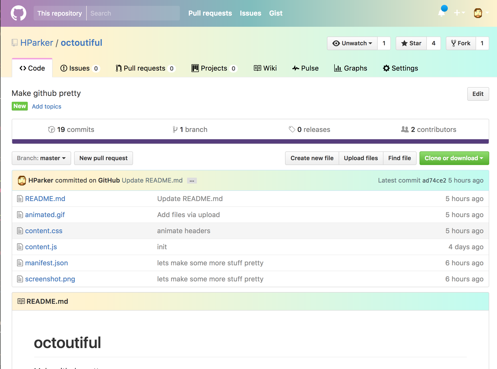

# octoutiful
Make github pretty

How to install:

1. Go here:
https://chrome.google.com/webstore/detail/octoutiful/kpbpdkdggjicdjfngdefpahhnfffodbb

2. Click the button.

OR

1. go to chrome://extensions

2. check the developer box at the top of the page

3. clone this repo

3. pick your extension from the file picker

4. enjoy the new colors
